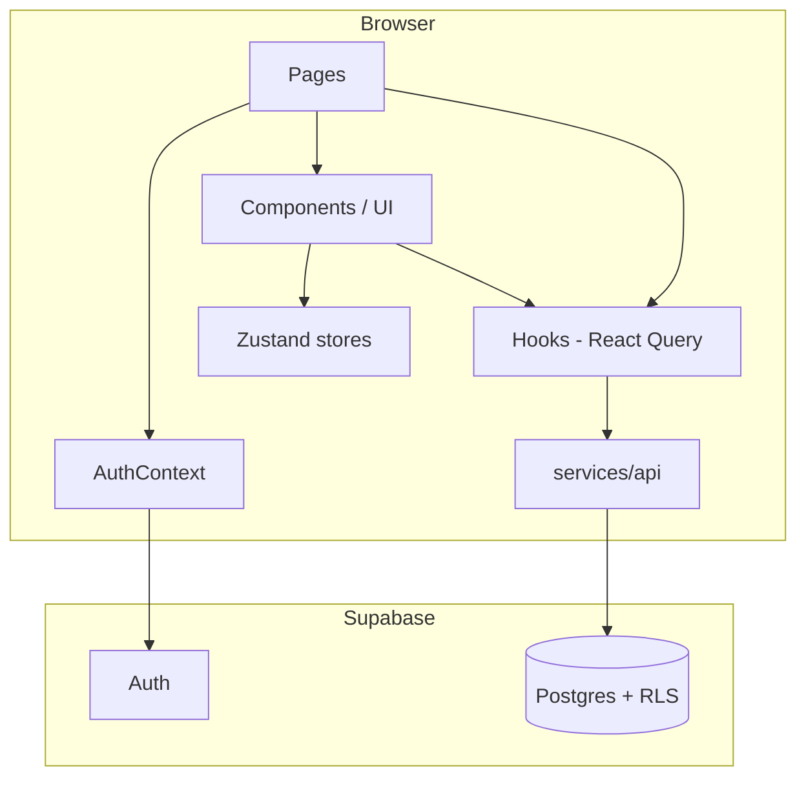
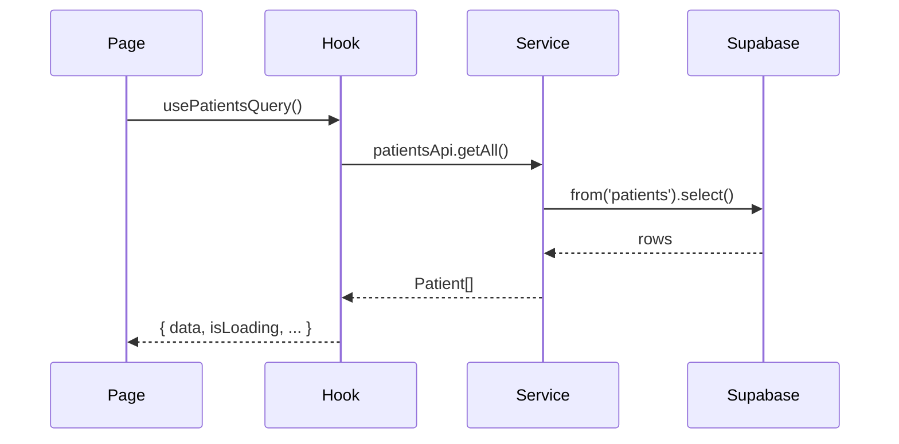
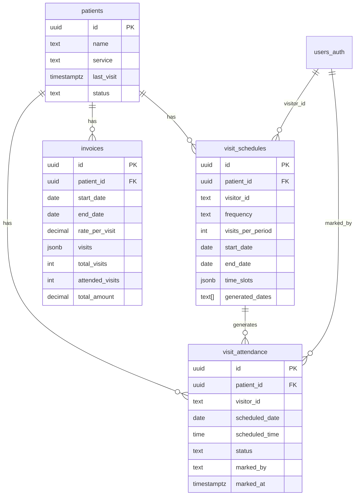

# One Rehab — architecture and tech stack

High-level architecture, technology choices, and important packages. For product scope and users, see [spec.md](spec.md).

---

## Tech stack overview

| Layer | Technology |
|-------|------------|
| **Framework** | Next.js 16 (Pages Router) |
| **Language** | TypeScript 5.x |
| **UI** | React 18 |
| **Styling** | Tailwind CSS 3, tailwindcss-animate |
| **Components** | Radix UI (Dialog, Select, Label, Slot, Toast), class-variance-authority (cva), tailwind-merge |
| **Server state** | TanStack React Query v5 |
| **Client state** | Zustand |
| **Backend / DB** | Supabase (Postgres + Auth) |
| **Routing** | Next.js Pages Router (`pages/`, `next/router`, `next/link`) |
| **Animations** | Framer Motion |
| **Icons** | Lucide React |
| **Toasts** | Sonner (+ Radix Toast primitives) |
| **Dates** | date-fns |
| **Dev / test** | ESLint, MSW (Mock Service Worker), Faker |

---

## Important packages

| Package | Purpose |
|---------|--------|
| `next` | App framework, SSR/SSG, API routes, routing |
| `@supabase/supabase-js` | Supabase client: Auth (session, login, RLS), Postgres via REST/Realtime |
| `@tanstack/react-query` | Server state: caching, queries, mutations, invalidation |
| `zustand` | Client state (e.g. UI state, selected items) |
| `tailwindcss` | Utility-first CSS |
| `@radix-ui/react-*` | Accessible primitives (Dialog, Select, Label, Toast, Slot) |
| `class-variance-authority` (cva) | Component variants without prop drilling |
| `tailwind-merge` | Merge Tailwind classes without conflicts (used in `cn()`) |
| `clsx` | Conditional class names (used in `cn()`) |
| `framer-motion` | Page and component animations |
| `date-fns` | Date formatting and manipulation (visit scheduling, etc.) |
| `lucide-react` | Icon set |
| `sonner` | Toast notifications |
| `msw` | API mocking in development |

---

## High-level architecture

```
┌─────────────────────────────────────────────────────────────────┐
│                        Browser (client)                          │
│  ┌─────────────┐  ┌──────────────┐  ┌─────────────────────────┐│
│  │   Pages     │  │  Components  │  │  Hooks (React Query +    ││
│  │ (Next.js)   │──│  (UI + Radix)│──│   custom)                ││
│  └─────────────┘  └──────────────┘  └────────────┬──────────────┘│
│         │                  │                      │              │
│         │                  │                      ▼              │
│         │                  │             ┌───────────────┐      │
│         │                  │             │  services/api  │      │
│         │                  │             │  (Supabase     │      │
│         │                  │             │   client)     │      │
│         │                  │             └───────┬────────┘      │
│         │                  │                     │              │
│  ┌──────┴──────┐     ┌──────┴──────┐             │              │
│  │ AuthContext │     │  stores/    │             │              │
│  │ (Supabase   │     │  (zustand)  │             │              │
│  │  Auth)      │     └─────────────┘             │              │
│  └──────┬──────┘                                 │              │
└─────────┼───────────────────────────────────────┼───────────────┘
          │                                       │
          ▼                                       ▼
┌─────────────────────────────────────────────────────────────────┐
│                     Supabase (hosted)                            │
│  ┌─────────────────────┐  ┌─────────────────────────────────┐  │
│  │  Auth (sessions,     │  │  Postgres (patients,             │  │
│  │  Google OAuth, etc.) │  │  visit_schedules,                │  │
│  └─────────────────────┘  │  visit_attendance, invoices)     │  │
│                           │  + RLS                             │  │
│                           └─────────────────────────────────┘  │
└─────────────────────────────────────────────────────────────────┘
```

- **Pages** render UI and use **hooks** for data. Hooks call **services** (e.g. `patientsApi`, `visitsApi`, `attendanceApi`, `invoicesApi`), which use the **Supabase client** in the browser. There is no separate BFF layer: the app talks to Supabase directly from the client (with RLS enforcing access).
- **Auth** is Supabase Auth (email/password + Google OAuth); **AuthContext** exposes `user`, `login`, `logout`, and guards routes.
- **Client-only state** (e.g. selected items, UI toggles) lives in **Zustand** stores under `stores/`.

---

## Mermaid diagrams

### Application layers and data flow



### Request flow (e.g. load patients)



### Core domain entities and relations



---

## Folder structure (key areas)

| Path | Purpose |
|------|--------|
| `pages/` | Next.js pages and API routes (`pages/api/*`) |
| `components/` | Reusable UI; `components/ui/` = primitives (Button, Card, Dialog, etc.); `components/animations/` = FadeIn, PageTransition |
| `contexts/` | React context (e.g. AuthContext) |
| `hooks/` | React Query hooks and custom hooks; call `services/api/*`, never Supabase directly from pages |
| `services/api/` | Data access: patients, visits, attendance, invoices; all use `lib/supabase/client` |
| `lib/` | queryClient, supabase client/server, utils (`cn()`), animations |
| `stores/` | Zustand stores (UI state, selection state) |
| `types/` | Shared TypeScript types |
| `utils/` | Pure helpers (e.g. visitScheduler, storage) |
| `styles/` | globals.css, module CSS |
| `supabase/` | Schema, migrations, auth docs |

---

## Key integration points

- **Auth**: `AuthContext` uses `supabase.auth` for session and redirects. Route guard in `_app.tsx` sends unauthenticated users to `/login` and authenticated users away from `/login` to `/dashboard`.
- **React Query**: `QueryClientProvider` in `_app.tsx`; hooks in `hooks/` use `useQuery` / `useMutation` and invalidate cache on mutations. No direct Supabase calls from pages.
- **Supabase RLS**: Row-level security is applied in Postgres; the client uses the anon key and relies on RLS for tenant/user scoping (see `supabase/schema.sql` and related docs).
- **MSW**: In development, `_app` can load `src/mocks/browser` to intercept API calls if needed; current data path is client → Supabase, so MSW is available for future or legacy API routes.
- **PWA**: Optional service worker registration in `_app.tsx` for `/sw.js` and `public/manifest.json`.

---

## References

- Product spec: [docs/spec.md](spec.md)
- Supabase schema: [supabase/schema.sql](../supabase/schema.sql)
- Cursor rules: `.cursor/rules/fullstack-development.mdc` (components, API, DB conventions)
